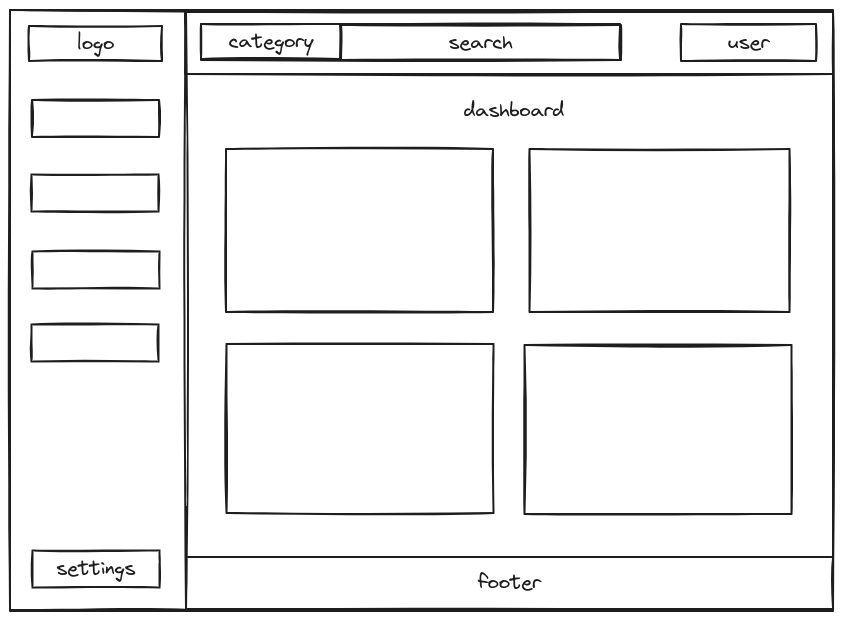

# Bodtrack 2 MVP

The first version of Bodtrack tracked your body weight. The second version will focus on doing that along with tracking BMI, wilks score, and strength progress and visualizing that data. The first version was built using Python, Flask, and SQLite. This version will be built with PHP and MySQL.

## Features

- Create/log in to your personal account
- Add and track your weight, BMI, wilks score, and strength progress
- Data visualization of weight, BMI, wilks score, and strength

## Designs

#### Dashboard design

## Languages/tools used:

- JavaScript
- Chart JS
- Webpack
- PHP
- MySQL
- Docker

## Contributing

Pull requests are welcome. For major changes, please open an issue first to discuss what you would like to change.